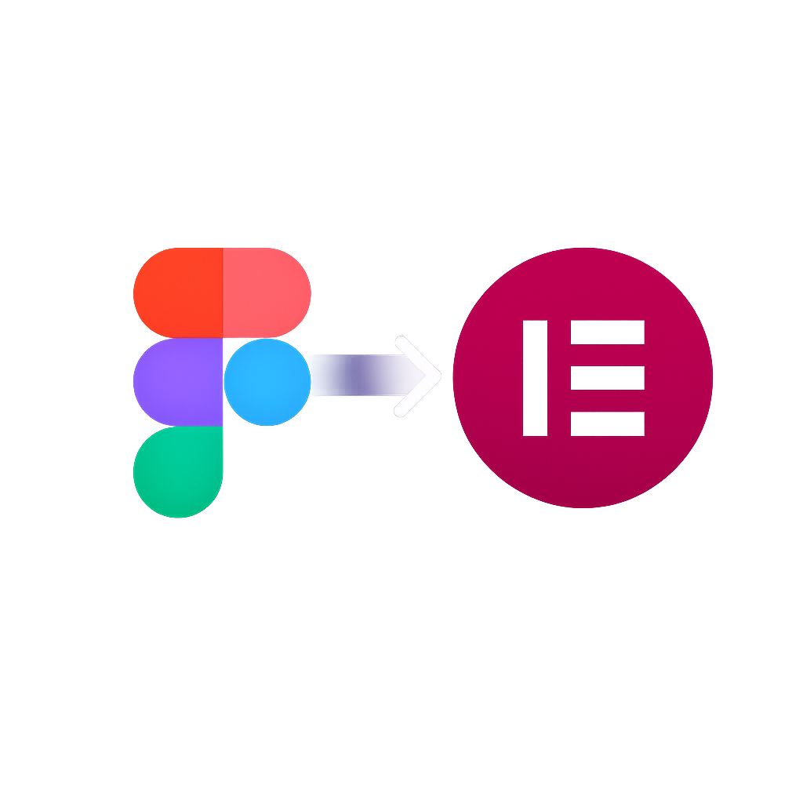

<p align="center">
  
</p>

<h1 align="center">Figma to Elementor</h1>

<p align="center">
  Convert Figma frames into Elementor-compatible JSON that you can paste directly into the WordPress editor.
</p>

The plugin walks your selected Figma frames, maps each node to the closest Elementor widget or container, and produces a JSON payload in the Elementor clipboard format. You copy the JSON, switch to WordPress, and paste it onto the canvas — no manual widget-building required.

---

## Prerequisites

- **Figma Desktop** (the plugin cannot run in the browser editor)
- **WordPress** with **Elementor 3.6 or later**
- The **Flexbox Container** experiment enabled in Elementor → Settings → Experiments → Flexbox Container (set to Active)
- **Node.js 18+** and **npm** — required only to build the plugin from source

---

## Installation

1. Clone or download this repository:

   ```bash
   git clone https://github.com/your-username/figma-to-elementor.git
   cd figma-to-elementor
   ```

2. Install dependencies:

   ```bash
   npm install
   ```

3. Build the plugin:

   ```bash
   npm run build
   ```

   This produces `dist/code.js`, which Figma loads at runtime.

4. Open Figma Desktop, then go to **Plugins → Development → Import plugin from manifest**.

5. Select the `manifest.json` file in this repository's root. The plugin now appears under **Plugins → Development → Figma to Elementor**.

---

## How to Use

1. Open your Figma file and select one or more top-level frames on the canvas.
2. Run the plugin: **Plugins → Development → Figma to Elementor**.
3. In the plugin panel, enter your **WordPress Site URL** (e.g. `https://yoursite.com`). This is written to the `siteurl` field Elementor uses to validate and rewrite asset references during paste.
4. Toggle **Skip hidden layers** on (default) to exclude invisible nodes, or off to include them.
5. Toggle **Export images as base64** on if you want fill images and image-filled shapes embedded as base64 data URIs in the output. Leave it off for a faster conversion with placeholder URLs instead.
6. Toggle **Skip decorative elements** on to drop background shapes, dividers, and other nodes with no text or image content.
7. Click **Convert**.
8. Any warnings (unsupported nodes, deep nesting, missing auto-layout) appear below the output.
9. Click **Copy** to copy the JSON to your clipboard.
10. In WordPress, open the page in **Elementor**.
11. Right-click anywhere on the Elementor canvas and choose **Paste from other site**.
12. In the modal that appears, press **Ctrl+V** (or **Cmd+V** on Mac) to paste the JSON, then click **Paste**.

The converted containers and widgets appear on the canvas, ready to edit.

---

## Supported Figma Elements

| Figma node type | Elementor output | Notes |
|---|---|---|
| Frame (auto-layout) | Flexbox Container | Direction, gap, padding, alignment preserved |
| Frame (no auto-layout) | Container with `position: relative` | Children positioned absolutely via custom CSS |
| Component / Instance | Flexbox Container | Treated identically to a Frame |
| Group | Container | No padding or gap; children laid out absolutely |
| Text (heading) | Heading widget | Applied when font size ≥ threshold (default 20 px) or weight ≥ 700 |
| Text (body) | Text Editor widget | Mixed-style text rendered as inline `<span>` elements |
| Rectangle (solid/gradient) | Container | Background color or gradient applied as container background |
| Rectangle (image fill) | Image widget | Exported as PNG at 2× if Export images is enabled |
| Ellipse (solid/gradient) | Container | Same as Rectangle; no automatic `border-radius: 50%` |
| Ellipse (image fill) | Image widget | Same as Rectangle image fill |
| Line | Divider widget | Stroke color and weight mapped |
| Vector | Image widget | Rasterized to PNG at 2× |
| Boolean Operation | Image widget | Rasterized to PNG at 2× |
| Polygon / Star | Image widget | Rasterized to PNG at 2× |
| Component Set | Container | First variant is used |

---

## Options

### WordPress Site URL

The base URL of your WordPress site (e.g. `https://yoursite.com`). Written into the `siteurl` field of the Elementor clipboard JSON. Elementor uses this value during **Paste from other site** to validate the payload's origin and to rewrite asset URLs (image references, etc.) so they resolve against the destination site. Normally Elementor sets this automatically when you copy from one site; here the plugin fakes it. Set it to your production or staging URL before exporting.

### Skip hidden layers

When enabled (default), nodes with visibility set to hidden in Figma (`node.visible === false`) are excluded from the output entirely. When disabled, hidden layers are converted and included — Elementor will render them visibly, since Figma's hidden state does not map to Elementor's hide-on-device settings.

### Export images as base64

When enabled, the plugin calls `node.exportAsync()` on each image-fill node, encodes the bytes as a `data:image/png;base64,...` URI, and embeds it directly in the JSON. When disabled, those nodes receive a `PLACEHOLDER_<nodeId>` string instead, which you can replace manually after pasting.

Slower (export + encode) and produces a much larger JSON payload. Disable it if you only need the layout structure.

### Skip decorative elements

When enabled, nodes flagged as decorative (background shapes, dividers, lines with no text or image content) are dropped from the output. Reduces widget clutter when you only want the meaningful content of a frame.

---

## Known Limitations

- **Absolute positioning only for non-auto-layout frames.** Frames without auto-layout are approximated using `position: absolute` with pixel coordinates in custom CSS. This is a structural limitation — Elementor's flexbox containers do not natively support absolute child positioning the same way Figma does.
- **Multi-stop gradients are simplified to two stops.** Elementor's gradient background only accepts a start and end color. Intermediate color stops are discarded; only the first and last stops of the Figma gradient are used.
- **SVG shapes export as PNG.** Vector, Boolean Operation, Polygon, and Star nodes are rasterized at 2× scale. Scalable SVG output is not supported.
- **Fonts must be installed on the WordPress site.** Font family names from Figma are written verbatim into the Elementor settings. If the font is not loaded in WordPress (via Google Fonts, Adobe Fonts, or a custom upload), Elementor will fall back to the theme's default font.
- **Nesting deeper than 5 levels triggers a warning.** The plugin will still convert the structure, but very deep hierarchies can produce unexpected layouts. Flatten your Figma layers where possible before converting.
- **Ellipses do not become circles.** An ellipse is mapped to a container with a solid or gradient background but without `border-radius: 50%`. Add this manually in Elementor's border-radius settings after pasting.

---

## Development

To rebuild automatically whenever you change a source file:

```bash
npm run watch
```

The watcher uses esbuild's incremental mode. After each save, Figma picks up the updated `dist/code.js` automatically when you reopen the plugin (use **Plugins → Development → Figma to Elementor → Reload** or close and reopen the panel).

To do a one-off production build:

```bash
npm run build
```

Source files are in `src/`:

| File | Purpose |
|---|---|
| `src/figma-to-elementor.ts` | Node converters for all supported types and conversion options interface |
| `src/converter.ts` | Entry point that iterates the selection and assembles the final payload |
| `src/elementor-types.ts` | Helper functions for building Elementor JSON structures |
| `src/color-utils.ts` | Fill and shadow extraction utilities |
| `src/id-generator.ts` | Incrementing widget ID generator |
| `code.ts` | Plugin entry point — registers the UI and message handlers |
| `ui.html` | Self-contained plugin panel UI (HTML + CSS + JS) |
